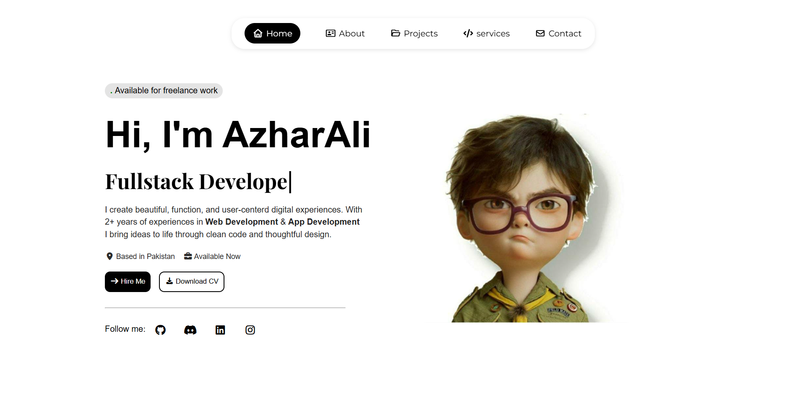

# 🌟 Animated Service Cards – React + Framer Motion

A **beautifully animated service cards section** built using **React**, **Framer Motion**, and **modern CSS**.  
Designed for **professional websites**, this component offers smooth hover animations, color transitions, and a fully responsive layout that looks stunning across all devices.

---

## 👾 Live Preview
You can preview this portfolio website here: <a href="https://azharali.vercel.app" target="_blank">LivePreview</a>

---

## 🖼️ Screenshots

### 💻 Desktop View


### 📱 Mobile View


---

## 🧩 Tech Stack


---

## ✨ Features

✅ **Responsive layout** – adapts perfectly to all screen sizes  
✅ **Smooth hover animations** with Framer Motion  
✅ **Color transition effects** on hover  
✅ **Non-disturbing image scaling**  
✅ **Clean, professional code structure**

---

## 🛠️ Setup & Usage

1. **Clone the repository**
   ```bash
   git clone https://github.com/yourusername/animated-service-cards.git
   
   cd animated-service-cards
